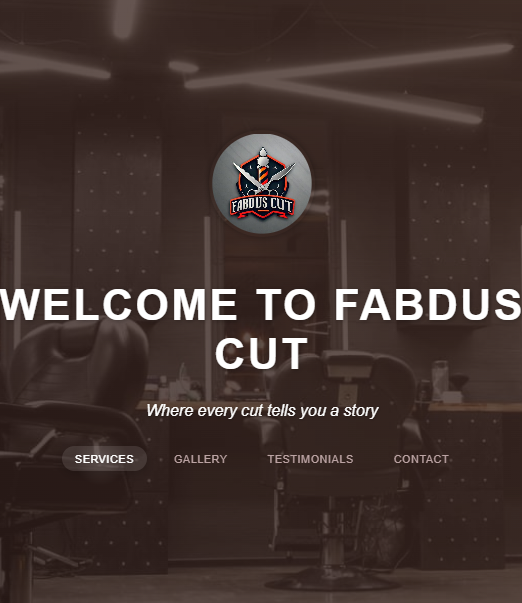
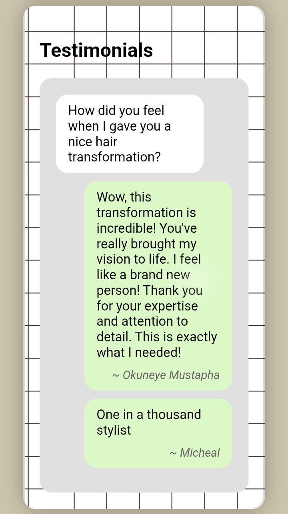

# 💈 FabdusCut Barber Website

A fully responsive, modern website built for **FabdusCut**, a local barbershop business.

> 🔗 **Live Preview**: [fabduscut.netlify.app](https://fabduscut.netlify.app)

---

## 🧩 Overview

This website features:

- Fully responsive, mobile-friendly layout using modern CSS techniques
- Custom animations and polished branding
- Fast, lightweight, and hosted via Netlify
- Custom branding & color palette
- Smooth user experience across devices

---

## 🚫 Note

> **Source code is private** due to client ownership.  
> This repository is a **portfolio showcase only**.  
> Screenshots and descriptions are included to present the project visually and technically.

---

## 📸 Screenshots

---

## 🛠️ Technologies Used

- HTML5
- CSS3 (Flexbox, Grid)
- JavaScript
- Netlify (Hosting)
